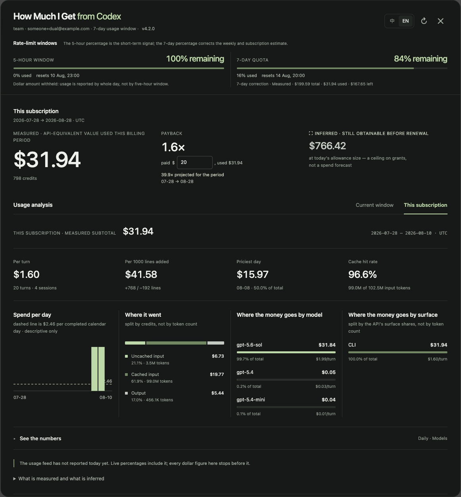

# How Much I Get From Codex

**[English](README.md) · [中文](README.zh-CN.md)**

A Tampermonkey panel for the Codex analytics page. It works out the number OpenAI does not
publish: **how much API usage your subscription actually gives you.**

The official page shows one bar — *Monthly usage limit, 70% remaining*. 70% of what? The
denominator is never named anywhere. This reads it off the API.



<sub>Follows the browser's light or dark theme.</sub>

For anyone on Plus, Pro, Business or Team who uses Codex enough to wonder what the
subscription is really worth.

**It requests nothing until you open it.** No polling, nothing on page load, nothing left
running after you close it.

---

## What it tells you

- What one allowance is worth, and how many you have used
- What is left in the current window, and when you run out at your pace
- How much more opens before your subscription renews
- What a turn costs, and what a thousand lines of code costs
- Which day, which model, and which surface took the most

---

## How the allowance is read

Two endpoints each hold half the answer:

| Endpoint | Gives | Missing |
|---|---|---|
| `daily-workspace-usage-counts` | what each day cost, in credits | what a full allowance is |
| `usage/daily-token-usage-breakdown` | each day as a **percentage of one allowance** | any amount |

Divide one by the other and you have the value of one percent:

```
allowance = a day's credits ÷ that day's percentage × 100
```

On a live Plus account that ratio came out at **49.897 credits per percent on all 26 days
with usage, with a spread of exactly zero** — an allowance of 4,989.7 credits. One of those
days landed on exactly 100.000%, so the figure can also just be read straight off it.

A single day is enough, and the rate limit window is never involved. That matters, because
the window is not always real: on some plans `used_percent` sits at 0 permanently while
`reset_at` slides forward with the clock. Dividing spend by that produces a confident number
resting on nothing. The panel detects it and hides everything built on those boundaries.

When both signals exist, the daily ratio owns the allowance value and the live window
division is a cross-check. If they differ by more than 5%, the panel keeps the measured daily
value and shows both numbers instead of silently changing sources.

There is one exception: **a reached limit outranks the daily ratio.** The spend standing when
the API closed *is* the allowance — no denominator involved — while the daily percentages can
divide by a stale one. This has happened live: OpenAI moved a Team seat from a monthly to a
weekly allowance and the daily endpoint kept dividing by the old monthly figure, reading
2.2× high while the account sat at 0%. When `limit_reached` is set and the two sources
disagree, the depletion point wins the headline, a banner says why the API closed
(`rate_limit_reached_type`) and when it resets, and the stale daily figure is disclosed next
to the number it disputes.

It also disposes of the question *when will it reset next*, by never asking. A day's
percentage is how much of an allowance that day ate, so adding them up counts allowances
directly. Crossing 100% means another one was spent.

### Where credits come from

Personal plans report credits directly, and reported credits always win. Plans that meter no
credits report 0, and only then does the script price the tokens itself from the
[official Codex rate card](https://learn.chatgpt.com/docs/pricing), last checked **2026-08-10**.

| Model | Uncached input | Cached input | Output |
|---|---|---|---|
| gpt-5.6-sol | 125 | 12.5 | 750 |
| gpt-5.6-terra | 50 | 5 | 300 |
| gpt-5.6-luna | 5 | 0.5 | 30 |
| gpt-5.5 | 125 | 12.5 | 750 |
| gpt-5.4 | 62.5 | 6.25 | 375 |
| gpt-5.4-mini | 18.75 | 1.875 | 113 |
| gpt-image-2 *(text tokens)* | 125 | 31.25 | 250 |

Credits per 1M tokens. The analytics fields are text-token fields, so GPT-Image-2 uses the
rate card's text row, not its image-token row. Removed models keep a separate legacy table in
the script so historical rows remain visible, and the panel flags when it uses one.

Fast mode multiplies current published rates — **2.5×** for GPT-5.6 and 5.5, **2×** for
GPT-5.4 ([source](https://learn.chatgpt.com/docs/agent-configuration/speed)) — and the script
reads the `speed` field so each tier is priced separately. Turns split between standard and
fast rows by credit share, the same rule shown in the UI.

If a model has no rate, its tokens are not given a made-up price. Any difference between the
known model rows and OpenAI's reported day total appears as **Unattributed**, so model totals
still reconcile to the headline.

### Dollars

The display converts at **1 credit = $0.04**, taken from the credit purchase page. OpenAI does
not publish a universal credit-to-dollar exchange rate, so this is an explicit configurable
assumption rather than part of the rate card. Change `USD_PER_CREDIT` at the top of the script
if your account shows a different price.

The dollar figure is therefore **credits × the configured display rate**. It is not OpenAI's
cost, and it is not the price of the allowance.

---

## Where it refuses to answer

A wrong number stated confidently is worse than a blank, so the panel withholds a figure
whenever the ground under it gives way:

- **The window is shorter than a day.** Usage only arrives in whole UTC days, so a five-hour
  window has nothing to divide into. No ceiling, no cycle view.
- **The window never opens.** 0% used with a reset that slides forward is a placeholder. The
  measured allowance and the spending still stand; the cycle boundaries and everything
  counted off them are hidden.
- **The allowance changed mid-period.** Then "N windows × today's allowance" would overstate
  what the payment bought — 43% high on a doubling. The count is shown, the product is not.
- **Fast mode with no published multiplier.** Priced at the standard rate and flagged as
  understated, rather than borrowing a neighbouring model's multiplier.
- **A model missing from the rate card.** Its tokens are not priced; reported credits remain
  visible in an Unattributed row.
- **Several matching subscriptions.** If two active workspace seats or two active personal
  subscriptions could both own the Codex context, there is no defensible renewal date. The
  panel asks you to choose the renewal date once; until then it withholds billing-period
  figures instead of substituting a calendar month.

### Projections

Two things open an allowance: the window rolling on its own schedule, and a **reset card**
spent by hand to open one early. Both are readable — `reset_at` steps forward on a fixed
boundary, and `rate_limit_reset_credits.available_count` says how many cards are left — so
the forecast is arithmetic rather than a guess about the future.

Spending is capped per window, not per day. Burn an allowance on the first morning and the
rest of that window yields nothing however fast you were going, so a daily average run
forward will happily print totals the account cannot reach. The projection is capped by the
allowances that actually open before renewal, and the panel names which constraint is
binding.

---

## Known biases, and which way they point

These are not unknowns. They lean in a known direction — read the numbers with them in mind.

| Source | Direction |
|---|---|
| **The pool is shared.** Codex, ChatGPT Work and ChatGPT for Excel draw on one allowance, but this API only sees Codex | Spend reads low, so the allowance reads low |
| **Cycle boundaries do not align with days.** The window opens at a timestamp; usage is bucketed by whole UTC days, and `group_by=hour` is rejected | The opening day is over-counted, so cycle spend reads high. Flagged when it happens |
| **The window percentage is coarse** — reported to the integer | Only affects the fallback path, used when no daily percentages exist |

Two things the API does not expose at all:

- **Per-turn cost.** The finest grain is day × model × speed, so the panel gives the dearest
  *day* per turn and the dearest *model* per turn instead.
- **Per-repository spend.** `code-attribution` accepts `group=workspace` and rejects
  everything else, so there is no split by project. Surface — CLI, VS Code, web, GitHub — is
  the closest available.

### Which subscription you are looking at

One login can hold a personal Plus and a workspace seat at once. The Codex endpoints answer
for whichever context Codex is in, and that is **not always the account the profile menu
names** — a `ChatGPT-Account-ID` header does not override it. The masthead therefore carries
the plan and the account email. One personal plus one workspace subscription can be matched
by structure; several active subscriptions of the same structure are treated as ambiguous,
with no per-seat local history written until the seat can be identified. When the API leaves
`account_id` empty, the renewal-date choice is stored locally for that email and plan and can
be changed from the subscription view.

Every request carries `workspace_user=true`, so the figures cover the current seat only.

---

## Install

1. Install [Tampermonkey](https://www.tampermonkey.net/)
2. Click **[how-much-i-get-from-codex.user.js](https://github.com/bigbobro/how-much-i-get-from-codex/raw/main/how-much-i-get-from-codex.user.js)** — Tampermonkey picks it up
3. Open the Codex usage page and click the label in the top-right corner:
   <https://chatgpt.com/codex/settings/usage> or
   <https://chatgpt.com/codex/cloud/settings/analytics>

Updates follow `@updateURL` back to this repository, so a push here reaches anyone who
installed it.

Interface language follows the browser and can be switched in the panel. The panel masthead
shows the installed version.

The script loads with ChatGPT, then shows the trigger only on the usage / analytics settings
pages. Arriving there through the sidebar is enough — no extra reload.

---

## Development

`smoketest.html` replays recorded API responses at the script, with no network and no login:

```bash
python3 -m http.server 8731
```

Open `http://127.0.0.1:8731/smoketest.html?all=1` to run all deterministic assertions. The
harness freezes the clock, cache-busts the userscript, checks the seven expected requests,
rejects userscript console errors, and prints one PASS/FAIL line per scenario.

| Scenario | What it covers |
|---|---|
| *(default)* | window-percent fallback, period source label, view/language focus, close/Escape/backdrop focus restoration |
| `#personal` | Plus-style: the workspace breakdown 400s, allowance measured at **$199.59** |
| `#spill` | billing period opens inside an unfetchable window — its in-period spend must show as a truncated row, and the table total must equal the headline **$209.57** |
| `#currentspill` | the live window crosses the billing-period start — current row and total are clipped to **$149.90** |
| `#multi` | 7-day window, a completed cycle, multi-opening forecast |
| `#boundary` | windows opening at 06:00 UTC — segments must partition the days exactly |
| `#changed` | allowance doubles mid-range; the reading follows today and says what it dropped |
| `#conflict` | daily measurement **$399.18** wins over a conflicting **$299.39** live-window inference, with both disclosed |
| `#depleted` | the limit closes at **$177.63** while stale daily percentages still claim $399.18 — the depletion point wins, a banner explains, the stale figure is disclosed |
| `#unknownmodel` | a metered unknown model reconciles the reported **$49.90** into Unattributed, never NaN or a zero-dollar model row |
| `#mixedunknown` | a known row keeps its **$0.20** price while only the **$1.80** reported remainder becomes Unattributed |
| `#bank` | reset cards left, counted on top of the windows that roll on their own |
| `#unusedcard` | a status of `unused` is not mistaken for `used` |
| `#twosubs` | one login, two subscriptions — the panel must name which one it reports |
| `#sameworkspaces` | two matching workspace subscriptions — asks for the renewal date, no per-seat memory write before selection |
| `#samepersonals` | two matching personal subscriptions — choosing 08/18 refetches and totals the real 07/18 → 08/18 period |
| `#hourly` | 5-hour window — refuses to infer, and says why |
| `#fresh` | placeholder window |
| `#fast` | standard/fast turn allocation uses credit share; unknown multipliers remain flagged |
| `#noent` | no renewal date — withholds the subscription view rather than substituting a calendar month |
| `#zerobasis` | the latest completed zero-spend window remains a valid pace basis |
| `#rates` | current Terra, Luna and GPT-Image-2 text-token rates |
| `#projection` | placeholder window keeps measured spend and calendar-day average, but no uncapped projection |
| `#surfaces` | one metered day split 50 / 30 / 20 across CLI, VS Code and web |

The default case still reproduces the recorded **$249.83 spent / $250.00 allowance**. The
suite also checks every panel for `NaN` / `undefined` and verifies that all window-table
totals reconcile to their period headlines.

The stub honours `start_date` / `end_date` deliberately. One that returned everything would
let a scenario pass on data the script never fetched, which is how an under-fetching bug
survives a green test.

---

## Licence

MIT
