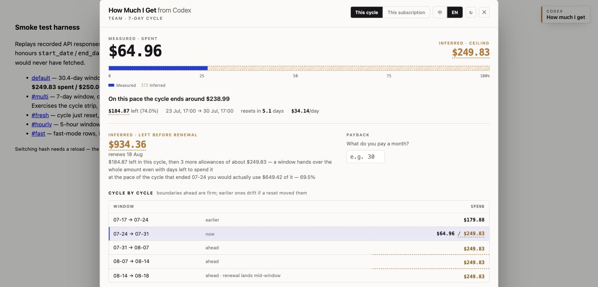

# How Much I Get From Codex

**[English](README.md) · [中文](README.zh-CN.md)**

> A userscript that works out the number OpenAI never tells you: **how much API spend your Codex subscription is actually worth.**

OpenAI has never published how much usage a given plan buys. The analytics page gives you
one bar — *Monthly usage limit, 70% remaining* — and never names the denominator.
70% of **what**?

This script works out the denominator.



<sub>Dark theme: <a href="docs/panel-dark.jpg">docs/panel-dark.jpg</a></sub>

---

## What it answers

- Roughly what this cycle's ceiling is, in dollars
- What you have spent, what is left, and when you run out at the current pace
- How much allowance is still coming before your subscription renews
- **How many separate allowances one payment actually bought.** The window resets on its own
  clock, so a billing period often contains more than one — burn through an allowance, wait
  for the reset, and a second full one opens before the payment renews
- What a turn costs you, and what a thousand lines of code costs you
- Which day, which model, which surface, which skill burned the most

**Nothing is requested until you open the panel.** No background polling, no requests
on page load, nothing running after you close it.

---

## How it works

The API hands you two halves that never sit next to each other:

| Endpoint | Gives you | Missing |
|---|---|---|
| `/backend-api/wham/usage` | percent of this cycle used | the denominator |
| `/backend-api/wham/usage/daily-workspace-user-token-usage-breakdown` | per-model token counts | the money |

Put them together:

```
per-model tokens × official rate card = credits spent    exact
credits ÷ used percent                = the ceiling      inferred
credits × $0.04                       = dollars
```

### Why the credits step is exact, not an estimate

Because it was checked. `/backend-api/wham/usage/daily-token-usage-breakdown` returns
OpenAI's own per-model shares. Against 2026-07-22:

| Model | OpenAI's own figure | Computed here from the rate card |
|---|---|---|
| gpt-5.6-sol | 99.70738778824162 % | 99.7074 % |
| gpt-5.4 | 0.17148759273530126 % | 0.17148 % |
| gpt-5.4-mini | 0.12112461902308662 % | 0.12117 % |

Four to five significant figures. The rate card is not an approximation of OpenAI's
pricing function — it *is* the pricing function.

The only inference in the whole chain is that one division, plus the credits-to-dollars rate.
The interface keeps the distinction visible throughout: **solid blue is measured,
dashed amber is inferred.**

### Projecting past the current cycle

The allowance window and the billing period run on unrelated clocks. The window rolls from
its own reset, so a billing period holds a fractional number of windows.

Counting **forward** from `reset_at` is firm — the window length is fixed, so every boundary
between now and the renewal date is known. Counting **backward** is not: an early reset would
have shifted every earlier boundary. Past cycles are therefore shown with that caveat and are
never averaged.

When a completed cycle exists, **only the most recent one** sets the expected pace. Averaging
older cycles would smear over exactly the change you are trying to see. A past cycle only
counts if every one of its days was fetched — a partial slice reported as a whole cycle would
quietly understate every projection built on it.

Granted and usable are kept apart. **A window opening hands over the whole ceiling**, even when
only two days of the billing period remain; what limits you then is time, not allowance. So the
allowance figure counts openings at full value, and a separate line says how much of it you
would actually get through at the last full cycle's pace.

### Where it refuses to guess

The window length is read from the API and never assumed — the same plan tier ships weekly on
one account and monthly on another, and some plans run a 5-hour window.

When the window is **shorter than a day**, the script refuses to infer anything and says so.
Usage only ever arrives in whole UTC days, so dividing a day's spend by a five-hour window's
percentage would produce a ceiling several times too large. A blank is better than a
confidently wrong number.

Likewise, fast mode is only priced where OpenAI publishes a multiplier. A model running fast
without one is priced at the standard rate and flagged as understated, rather than having a
neighbouring model's multiplier guessed onto it.

### Rate card

Credits per 1M tokens, from the [official rate card](https://help.openai.com/en/articles/20001106-codex-rate-card):

| Model | Uncached input | Cached input | Output |
|---|---|---|---|
| gpt-5.6-sol | 125 | 12.5 | 750 |
| gpt-5.6-terra | 62.5 | 6.25 | 375 |
| gpt-5.6-luna | 25 | 2.5 | 150 |
| gpt-5.5 | 125 | 12.5 | 750 |
| gpt-5.5-cyber | 500 | 50 | 3000 |
| gpt-5.4 | 62.5 | 6.25 | 375 |
| gpt-5.4-mini | 18.75 | 1.875 | 113 |
| gpt-5.3-codex | 43.75 | 4.375 | 350 |
| gpt-5.2 | 43.75 | 4.375 | 350 |

Fast mode multiplies the rate: **2.5×** for GPT-5.6 and 5.5, **2×** for GPT-5.4
([source](https://learn.chatgpt.com/docs/agent-configuration/speed)). The script reads the
`speed` field and prices each tier separately.

---

## Install

This repository is private, so the usual one-click raw link will not resolve. Install it by hand:

1. Install [Tampermonkey](https://www.tampermonkey.net/)
2. Open the Tampermonkey dashboard, create a new script, and paste in
   [`how-much-i-get-from-codex.user.js`](how-much-i-get-from-codex.user.js)
3. Open <https://chatgpt.com/codex/cloud/settings/analytics> and click the label in the corner

If the repository is ever made public, a raw link to the `.user.js` file installs in one click,
and Tampermonkey will follow `@updateURL` from there.

Interface language follows your browser and can be switched in the panel.

---

## Known biases, and which way they point

None of these are unknowns. They are biases with a known direction — read the numbers
with them in mind.

| Source | Direction |
|---|---|
| **Credits-to-dollars rate** is set at 1 credit = $0.04 (1000 credits = $40). OpenAI has never published it; this comes from the credit purchase page | If the rate is wrong, every dollar figure scales with it. Change `USD_PER_CREDIT` at the top of the script |
| **Cycle boundaries do not align with days.** The window opens at a precise timestamp, but usage is only bucketed by whole UTC days, and the API rejects `group_by=hour` | The first day is over-counted, so **spend reads high and the ceiling reads high**. The panel flags this when it happens |
| **The pool is shared.** Codex, ChatGPT Work and ChatGPT for Excel draw on the same allowance, but this API only sees Codex | **Spend reads low, so the ceiling reads low** |
| **The used percentage is coarse** — the API reports it to the integer | At 1% used the inferred ceiling is meaningless. Above 50% it is worth trusting |

Two things the API simply does not expose:

- **Per-turn cost.** The finest granularity is day × model × speed. The panel gives you the
  dearest *day* per turn and the dearest *model* per turn instead.
- **Per-repository or per-project spend.** `code-attribution` only accepts `group=workspace`;
  every other grouping is rejected. Surface — CLI, VS Code, web, GitHub, Slack — is the closest
  breakdown available.

---

## Scope

Every request carries `workspace_user=true`, so figures cover **the current seat only**.
Without it, `daily-workspace-usage-counts` returns the whole workspace while the used
percentage stays personal — a numerator and a denominator that do not belong to each other.

---

## Development

`smoketest.html` replays recorded API responses at the script with no network and no login:

```bash
python3 -m http.server 8731
```

| URL | Scenario | Expected |
|---|---|---|
| `smoketest.html` | one real day, 30.4-day window, 99.93% used | **$249.83 spent / $250.00 ceiling** |
| `smoketest.html#multi` | 7-day window, a completed cycle, renewal 24 days out | cycle strip, pace basis, multi-opening projection |
| `smoketest.html#fresh` | cycle just reset, 0% used | lands on the subscription view |
| `smoketest.html#hourly` | 5-hour window | refuses to infer a ceiling, and says why |
| `smoketest.html#fast` | fast-mode rows, one with no published multiplier | 2.5× applied, the other flagged |

The first case is the regression test that matters: the recorded day is real usage, and
$250.00 is the ceiling it should reproduce.

The stub honours `start_date` / `end_date` on purpose. A stub that returned everything would
let a scenario pass on data the real script never fetched, which is how an under-fetching bug
hides.

---

## Licence

MIT
